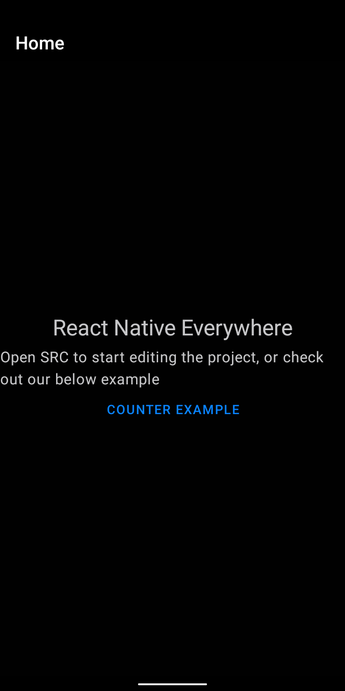
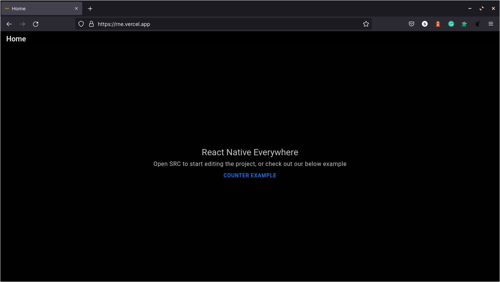
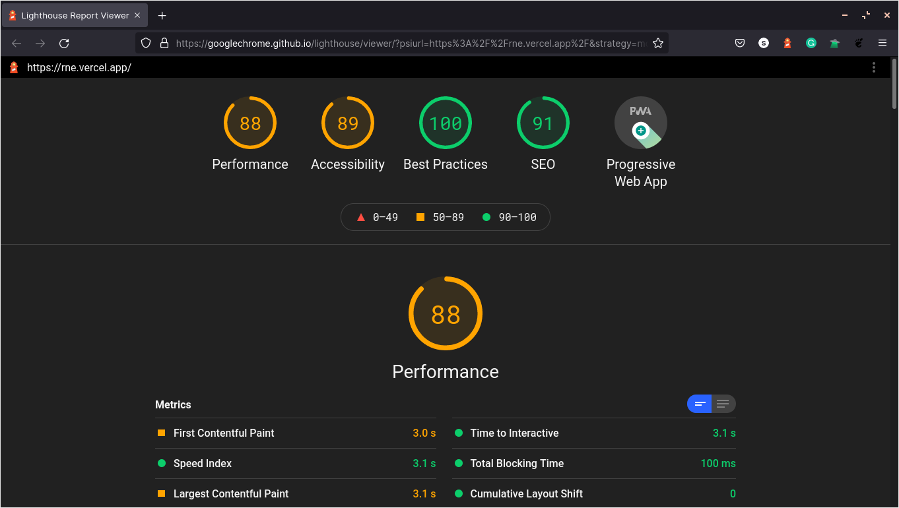
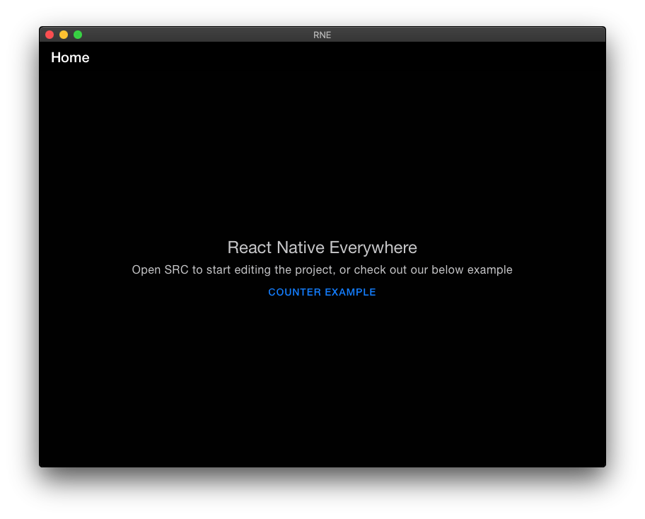
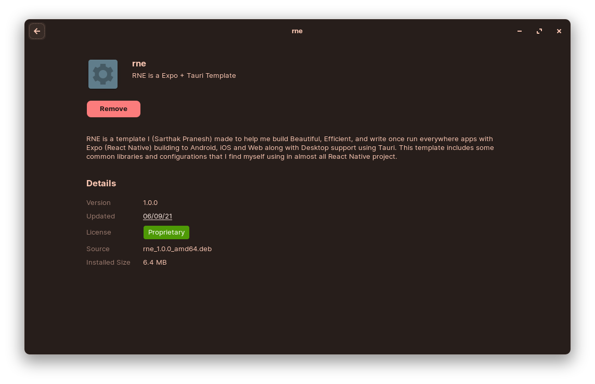
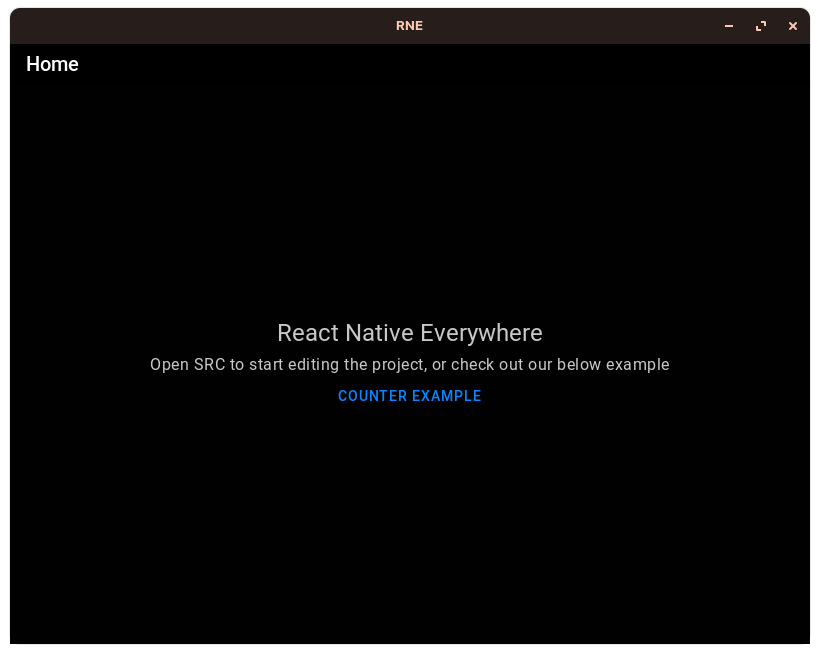

# React Native Everywhere

### Expo ( Android + Web + iOS ) + Tauri ( Desktop ) = ♥

 

## What is RNE?

RNE is a template I made to help me build Beautiful, Efficient, and write once run everywhere apps with Expo (React Native) building to Android, iOS and Web along with Desktop support using [Tauri](https://github.com/tauri-apps/tauri). This template includes some common libraries and configurations that I find myself using in almost all React Native project.

Beware: I am using libraries and configuration the way I like the most, your choices and the most efficient way to do it might differ.

 

## Whats included
The most relevant list of packages included in the template are as follows:
- [React Native Paper](https://callstack.github.io/react-native-paper/)
- [React Navigation](https://reactnavigation.org/)
- [Redux](https://redux.js.org/) along with `redux-logger` and `redux-persist`
- [react-redux](https://react-redux.js.org/)
- [React Native Async Storage](https://react-native-async-storage.github.io/async-storage/docs/install/)
- [Tauri](https://github.com/tauri-apps/tauri)

 

## Using the template
To Get started click on that `Use this template` button in the repository and create your own repository.
### Initial changes
We have to make some initial changes before we start building our app, please follow below steps carefully:
- change all the relevant fields to your project specific details in `./app.json` and `./src-tauri/tauri.conf.json` 
- change the app icons in `assets`, namely the `adaptive-icon.png`, `favicon.png`, `icon.png` and `splash.png`. Tauri specific icons will be generated using `./assets/icon.png`, once you have added the new assets run `yarn tauri icon ./assets/icon.png` this will generate the asset icons required by our desktop builds.

Now its time you build your app :>

### Working 
Their are multiple scripts in the `package.json`, most of them are just the default once that come with tauri and expo so I won't be documenting them. Building your Android, iOS and Web app using this template is same when using just `expo` so I will be skipping that. You can find below the general flow of development for desktop apps though.

For developing desktop app their are actually two steps:
- tauri depends on a web bundler like `webpack` so we first start our expo web development server using `yarn web` and we leave it running
- open another terminal and now we can run `yarn desktop` that will start our tauri app in development mode

For building desktop app we employee a similar approach:
- we first build our web version of the app using `yarn build-web`
- once the web version is build we use `tauri` to package the web app using `yarn build-desktop`

 

## Issues
Enjoy the errors they are a feature :P ( kidding open an issue/improvements [here](https://github.com/sarthakpranesh/react-native-everywhere/issues))

 

## What to expect
This template will allow you to build beautiful React Native apps quickly for almost all platforms ( Android + iOS + Web + Linux + Windows + MacOS ). For platform specific APIs on Android, iOS and Web things need to be handled using Expo, whereas for desktop we'll be using what's provided by Tauri. This template is fast and reliable and I have run the light house test on it (results below). You can find the release builds for the template in [Github Release Page](https://github.com/sarthakpranesh/react-native-everywhere/releases)

### Android

    

### Web

    
    

### Mac

    

### Linux
#### Debian

    
    

#### AppImage

    

 

### Made with ♥ in India

